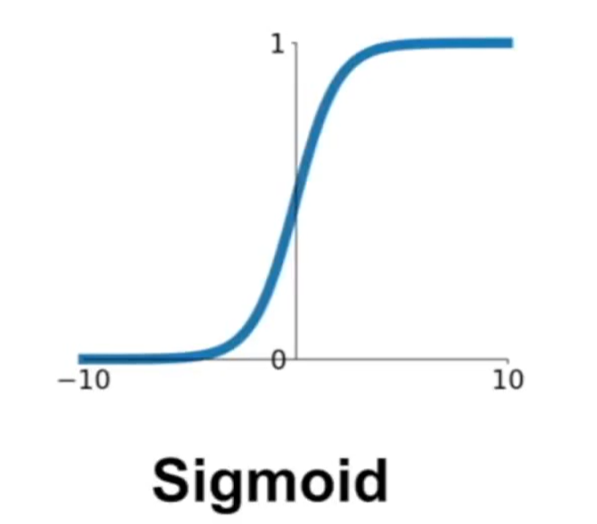
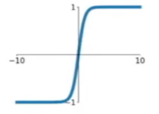
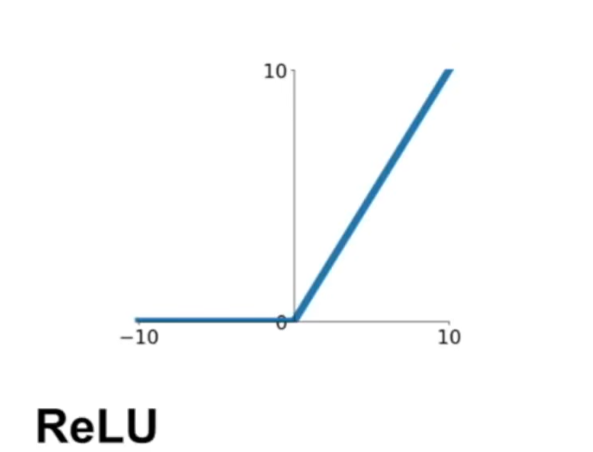
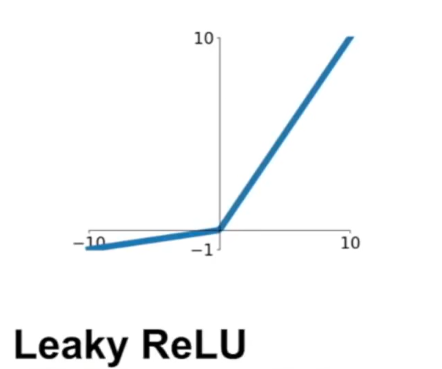
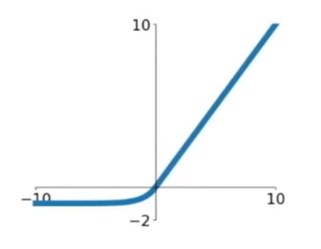
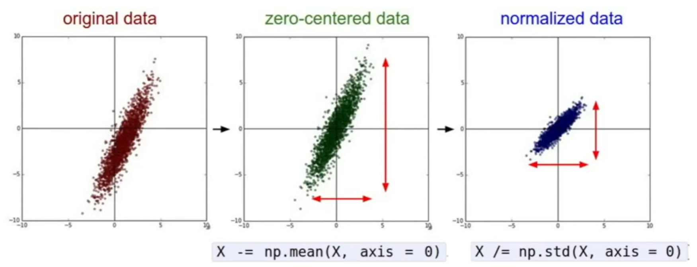

## develop 

1998 CNN to recognize check number 

2001 Adaboost

feature-based 

1999 SIFT   

2005 Histogram of Gradients

## course brief

image detect 

CNNs

## Lecture two 

### Image Classification

 #### data-driven approach

1. collect a dataset of images and labels 
2. use machine learning to train a classifier
3. evaluate the classifier on new images

### classifier

#### Nearest Neighbor

从训练集中寻找最接近的图片，作为预测标签

##### Distance Metric

L1 distanc

##### decision regions

##### cost

Train O (1)
Predict O(N)

#### K-Nearest Neighbors

根据最接近的N的训练样本，投票决定标签

##### decision regions

##### Distance Metric

L1 distance

L2 distance 

Question : L1 和L2 怎么选择
Ans : L1 更依赖于坐标系的选择，数据的特征（每个分量的值，即坐标轴数值）有价值的话，效果会更好 

#### Linear Classifiers

Format : `f(x,W) = W·x+b`

## Lecture three

### Loss function 

Define: 

### Regularization

## Lecture four

## Lecture five

 AlexNet

 

## Lecture Six

### Activation function

| 函数名                        | 方程                                                         | 图像                                                         |
| ----------------------------- | ------------------------------------------------------------ | ------------------------------------------------------------ |
| sigmoid                       | $\sigma(x) = 1/(1+e^{-x})$                                   |  |
| tanh                          | $f(x)=tanh(x)$                                               |                            |
| ReLU(Rectified Linear Unit)   | $f(x)=max(0,x)$                                              |  |
| Leaky ReLU                    | $f(x)=max(0.01x,x)$                                          |  |
| ELU(Exponential Linear Units) | $f(x) = \left \{\begin{array}{l}x & if\ x>0 \\\alpha (e^{x}-1) & if\ x \leq 0\end{array}\right .$ |  |

### data preprocession

### initial ization

`W = 0.01*np.rndom.rand(D,H)`

### batch normalization

## Lecture Seven

### Fancier optimization

SGD + Momentum

Nesterov

AdaGrad and RMSProp

Adam

### Regularization

Dropout

### transfer Learning

## Lecture Eight

## Lecture Nine

### AlexNet

Krizhevsky et al. 2012

### VGG 

### GoogLeNet

### ResNet

## Lecture Ten

## Lecture Eleven

## Lecture Twelve 

## Lecture Thirteen

